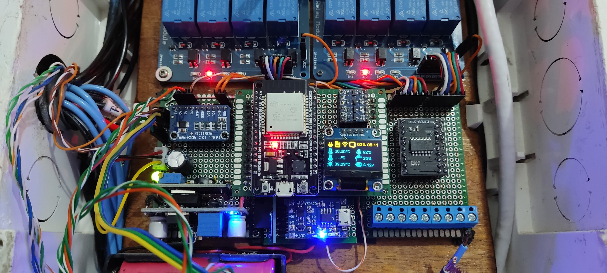

# Home Sweet Home - Projeto de Casa inteligente

### Um projeto de IOT para gerenciamento de lâmpadas via MQTT e Rádio Frequencia e Leitura de sensores diversos

Este projeto contempla uma série de funcionalidades todas embutidas em um único microcontrolador ESP32.
Cada funcionalidade utiliza sua própria task independente e as tasks são divididas entre os dois cores do ESP32.

Para o funcionamento das actions do Google Assistant utilizei uma ferramenta chamada [gBridge](https://doc.gbridge.io), que foi descontinuada, por isso instalei em meu próprio servidor com docker.
Como servidor MQTT utilizei o [Cloud MQTT](https://cloudmqtt.com).

## Vídeo

Veja o vídeo onde falo um pouco sobre o projeto

[](https://youtu.be/a0zFtHZcO2Y)

## Hardware

* [ESP32 Devkit V1](https://genilto.com/links/esp32)
* [OLED Display 12864 SSD1306](https://genilto.com/links/SSD1306)
* [Sensor Temperatura e umidade DHT11](https://genilto.com/links/dht11)
* [Módulo 4 Relês para arduino 5v](https://genilto.com/links/mod-4-rele-5v)
* [Módulo expansor de portas PCF8575](https://genilto.com/link/PCF8575)
* [Módulo Step Up Converter](https://genilto.com/links/step-up-converter)
* [LM2596S 3A Adjustable Step-down](https://genilto.com/links/step-down-converter)
* [Placa controladora de carga para baterias de lítio](https://genilto.com/links/lithium-charger-board)
* [Conversor de Nível Lógico](https://genilto.com/links/level-shifter)

## Protótipo criado



## Conexões

Perdi o arquivo do Fritzing...... Estou refazendo no kicad.

Mas os pinos que devem ser conectados estão no arquivo `Configurations.h`.
Preste atenção pois existem módulos que são 5v, por isso é necessário a utilização de um level shifter (conversor de nível lógico bidirecional 5v <-> 3.3v) para comunicação do módulo com o ESP32.


```cpp
#define SDA_PIN      SDA         // 21
#define SCL_PIN      SCL         // 22
#define ONE_WIRE_PIN 32          // Pino para conexões de um fio. Sensor de Temperatura por exemplo
#define DHT_SENSOR_PIN 33        // Pino para o sensor de temperatura e umidade
#define POWER_SENSOR_PIN 34      // Pino que irá identificar se existe tensão da rede (34 pino somente leitura, necessita de pulldown externo)
#define RX_PIN 12                // Pino de comunicação com a placa de RX 433 Mhz
#define TM_RST_PIN 15  // Chip Enable  - RST
#define TM_DAT_PIN 4   // Input/Output - DAT
#define TM_CLK_PIN 13  // Serial Clock - CLK
#define SD_CS_PIN   SS   // 5   - SS      CS (D5)
#define SD_MOSI_PIN MOSI // 23  - CMD     MOSI (D23)
#define SD_CLK_PIN  SCK  // 18  - CLK     SCK (D18)
#define SD_MISO_PIN MISO // 19  - DAT0    MISO (D19)
```

## Setup

### Libraries

As bibliotecas necessárias já estão mapeadas conforme arquivo `platformio.ini`

## Tutorial

### faça uma cópia do arquivo `env.example.ini` e nomeie como `env.ini`

Adicione as informações de Wifi e MQTT no arquivo criado `env.ini`.
Ao fazer o build da aplicação as variáveis serão substituídas conforme informado no arquivo.

Exemplo:

```cpp
[conf]
WIFI_SSID=yourSSID
WIFI_PASSWORD=yourWifiPassword
BROKER_MQTT=mxx.cloudmqtt.com
BROKER_PORT=12893
USER_MQTT=mqqtuser
PWD_MQTT=mqttpass
CLIENT_ID=esp32
```

## Idéias futuras

> Reestruturar a comunicação de filas, está muito complicado de acessar informações para exibir no visor, ou utilizar em outros lugares.
> Estou até pensando em remover os semáforos e reestruturar com menos tasks, dessa forma não tenho problema de acesso randômico na memória.
> Criar um painel de configurações web, de forma a ser possível mapear os interruptores RF por lá (Estão fixos!!)
